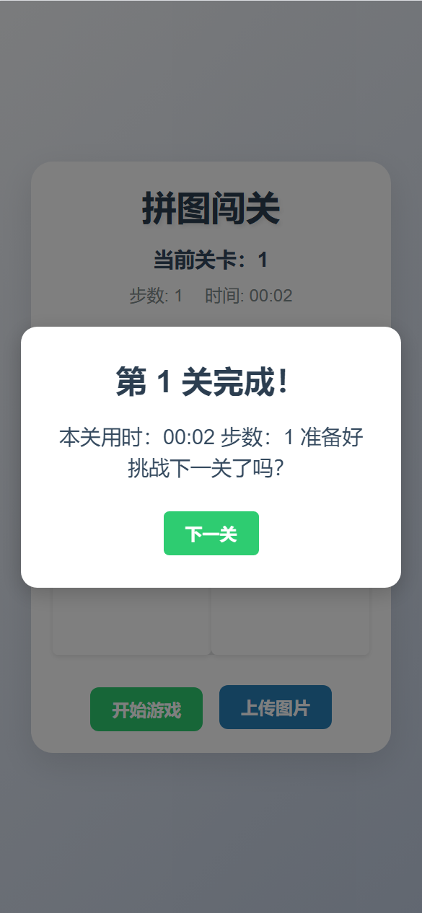

# 移动端H5拼图小游戏

## 项目简介
这是一个基于 HTML5 的移动端拼图小游戏。玩家可以通过触摸滑动来移动拼图块，将打乱的图片重新拼接成完整的图像。游戏设计简单直观，适合所有年龄段的用户，既可以打发时间，又能训练空间思维能力。

## 功能特点
- 支持移动端触摸操作，体验流畅
- 可选择不同难度级别（3x3, 4x4, 5x5）
- 支持自定义图片上传
- 实时计时和步数统计
- 排行榜系统记录最佳成绩
- 支持游戏进度保存
- 音效反馈增强游戏体验

## 项目演示

## 技术栈
- HTML5 Canvas
- CSS3 动画效果
- 原生 JavaScript
- LocalStorage 数据存储
- 触摸事件处理
- Web Audio API 音效系统

## 安装说明
1. 克隆项目
