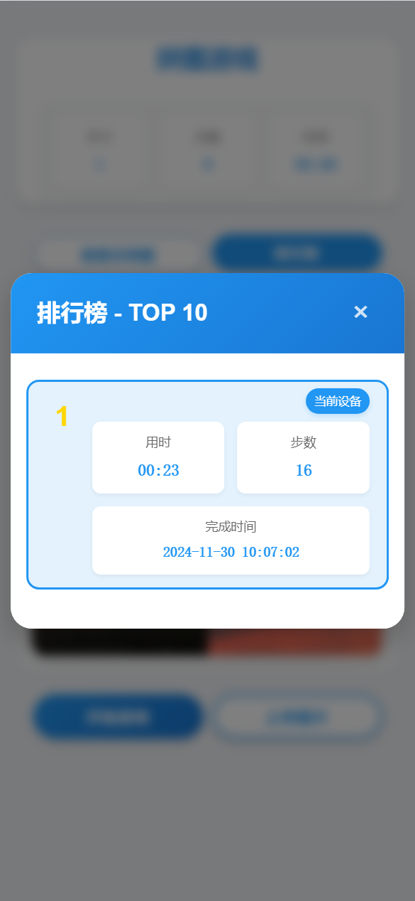

# 拼图游戏

一个基于 HTML5 的移动端拼图小游戏，支持触摸操作、自定义图片上传和多关卡挑战。

##项目截图




## 游戏特点

- 🎮 三个难度级别的关卡挑战
  - 第一关：4宫格 (2×2)
  - 第二关：9宫格 (3×3)
  - 第三关：16宫格 (4×4)
- 📱 完美支持移动端触摸操作
- 📸 支持自定义图片上传
- ⏱️ 实时计时和步数统计
- 🎯 关卡进度保存
- 🏆 成绩记录系统


## 游戏玩法

1. 点击"开始游戏"按钮开始游戏
2. 通过拖动拼图块重组完整图片
3. 每关通过后自动进入下一关
4. 三关全部通过即可完成游戏


## 技术栈

- HTML5
- CSS3
- JavaScript (ES6+)
- jQuery 3.6.0
- jQuery UI 1.13.2
- jQuery UI Touch Punch (移动端触摸支持)

## 浏览器支持

- Chrome (推荐)
- Firefox
- Safari
- Edge
- 移动端浏览器

## 功能说明


### 图片上传
- 支持上传本地图片
- 建议使用清晰的方形图片
- 图片会自动适配游戏区域

### 游戏操作
- PC端：鼠标拖拽
- 移动端：触摸拖动
- 拖动拼图块到其他拼图块位置可交换位置

### 关卡系统
- 每关难度递增
- 完成当前关卡后自动解锁下一关
- 支持重玩当前关卡

### 成绩统计
- 记录每关完成时间
- 统计移动步数
- 保存最佳成绩

## 开发说明


### 项目结构
    puzzle-h5/
    ├── index.html # 游戏主页面
    ├── css/
    │ └── style.css # 样式文件
    ├── js/
    │ ├── game.js # 游戏核心逻辑
    │ ├── storage.js # 数据存储相关
    │ └── leaderboard.js # 排行榜系统
    └── images/
    └── default-puzzle.jpg # 默认拼图图片


### 本地开发
1. 修改 `js/game.js` 调整游戏逻辑
2. 修改 `css/style.css` 自定义样式
3. 修改 `js/storage.js` 调整数据存储
4. 修改 `js/leaderboard.js` 自定义排行榜

### 注意事项
- 图片资源建议使用 CDN 或压缩后使用
- 注意移动端性能优化
- 建议使用现代浏览器开发和测试

## 本地运行

### 克隆仓库：
```bash
git clone https://github.com/sly3464/puzzle-h5.git
```

## 许可证

MIT License

## 贡献指南

1. Fork 项目
2. 创建功能分支
3. 提交更改
4. 推送到分支
5. 创建 Pull Request

## 联系方式

- 项目地址：[GitHub](https://github.com/sly3464/puzzle-h5)
- 问题反馈：[Issues](https://github.com/sly3464/puzzle-h5/issues)
